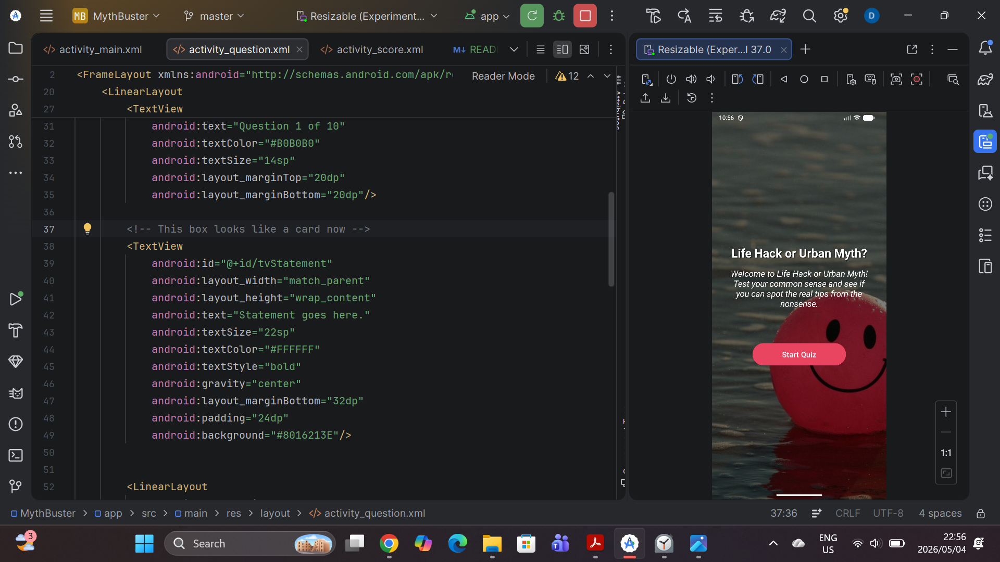
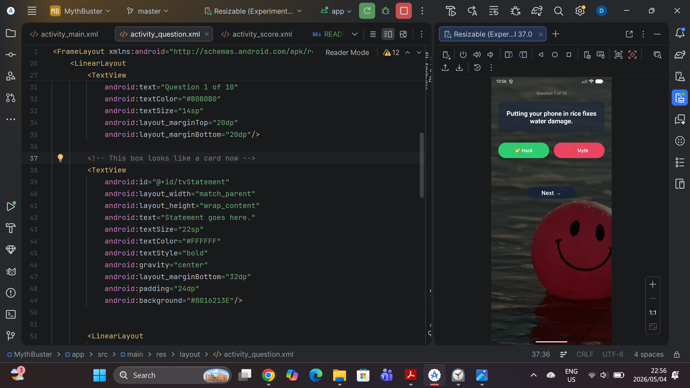

# Life Hack or Urban Myth? 🔍

## What's This App About?

So basically this app is a flashcard quiz game where you read a statement and decide whether it's a real life hack or just an urban myth people made up and kept spreading.

The idea is simple — you read the statement, tap Hack or Myth, get feedback, and at the end you see your score. There's also a review screen so you can go back and see where you went wrong.

## How It Works

1. Open the app → Welcome screen loads
2. Tap **Start Quiz** → first flashcard appears
3. Read the statement → tap **Hack** or **Myth**
4. Get instant feedback (right or wrong, plus an explanation)
5. Tap **Next** → keep going
6. After all 10 questions → Score screen shows your result
7. Tap **Review** to see all questions and the correct answers

---

## Screenshots 
Welcome Screen | Intro and start button

Question Screen

!

## Design Choices

I went with a dark colour scheme — dark navy background with light text — because I think it looks cleaner and easier to read, especially for something quiz-based. The feedback colours are green for correct and red for wrong, which I think is pretty intuitive.

I kept the layout simple on purpose. I didn't want to overcomplicate the UI when the point of the app is the content, not fancy animations.

The questions themselves I researched carefully to make sure they're actually accurate — I didn't want to include myths about myths, if that makes sense.

## GitHub Usage

I used GitHub to manage version control throughout the project. What I did was commit after finishing each screen rather than doing one big commit at the end. That way you can actually see the progress in the commit history.

The repo includes:
- All Kotlin source files
- XML layout files
- The GitHub Actions workflow
- This README

## GitHub Actions

I set up a GitHub Actions workflow that automatically builds the app every time I push new code. This is useful because it checks that the app actually compiles — not just on my machine but in a clean environment.

The workflow file is in `.github/workflows/build.yml` 
Basically every time I push, GitHub runs the build and tells me if something broke.

## References
Android Developers, 2024. Intents and intent filters. [online] Available at:
<https://developer.android.com/guide/components/intents-filters> [Accessed 4 May 2026].

Android Developers, 2024. Log. [online] Available at:
<https://developer.android.com/reference/android/util/Log> [Accessed 4 May 2026].

GitHub, 2024. Automated build android app with github action. [online] Available at:
<https://github.com/marketplace/actions/automated-build-android-app-with-github-action>
[Accessed 4 May 2025].

JetBrains, 2024. Kotlin documentation. [online] Available at:
<https://kotlinlang.org/docs/home.html> [Accessed 4 May 2026]...